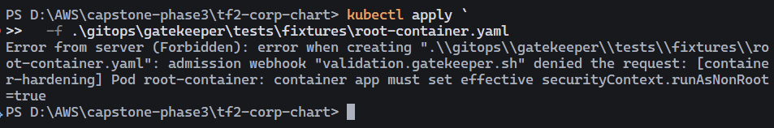
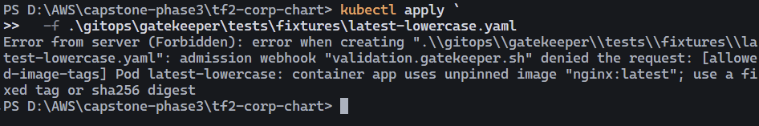
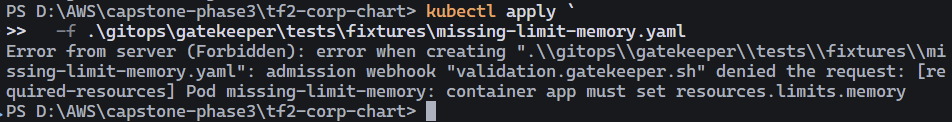
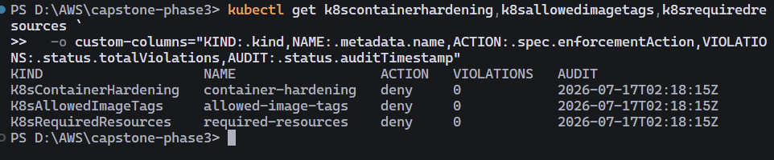

# ADR SEC-07: Production runtime hardening with Gatekeeper

- Status: Technically verified; pending mentor acceptance and signatures
- Date: 2026-07-17
- Owners: Platform Security and Platform Engineering
- Verified production revision: `3bfb118d65d84c24f23c330df63ce437950b3a87`

## Context

The production render contained eight unpinned BusyBox init-container images,
missing init-container resources, and Grafana's root `init-chown-data` container.
Static chart cleanup removes those known violations, but future manifests also
need an admission guardrail.

## Decision

Install the pinned upstream Gatekeeper chart `3.23.0` from the dedicated
`gatekeeper-chart` wrapper in this repository. Argo CD owns both the Gatekeeper
Helm release and three policies; AWS Terraform is not part of this decision:

- `K8sContainerHardening`: effective `runAsNonRoot=true`, no effective
  `runAsUser=0`, capability drop `ALL`, and no added Linux capabilities for
  containers, init containers, and ephemeral containers.
- `K8sAllowedImageTags`: fixed tags or valid SHA-256 digests; no missing tag or
  case-insensitive `latest`.
- `K8sRequiredResources`: CPU/memory requests and limits for containers and init
  containers. Kubernetes does not support resources on ephemeral containers.

Policies cover Pod, Deployment, StatefulSet, DaemonSet, ReplicaSet, Job,
CronJob, and ReplicationController. Only `kube-system`, `kube-public`,
`kube-node-lease`, and `gatekeeper-system` are excluded. Any future exception
must record owner, reason, expiry, and Platform Security approval.

The controller Application installs the chart into `gatekeeper-system`. The
policy Application remains separate because Gatekeeper must first install its
CRDs and generate the constraint CRDs before Constraints can be admitted. The
webhook is fail-closed and runs with two controller replicas, a PDB, and the
existing Critical MNG. Mutation, external data, generated-resource expansion,
and CRD upgrade hooks are disabled.

**Application ownership:** A root app-of-apps Application (`root-prod` from
`gitops/bootstrap/prod/`) reconciles child Application/AppProject CRs under
`gitops/clusters/prod/` (including Gatekeeper). Operators bootstrap the root once;
they do not hand-apply Gatekeeper Application manifests in steady state. The
policy Application was synced once for the deny cutover and remains **manual
sync** pending the Platform Security decision on automated self-heal.

## Rollout and rollback

1. Deploy chart cleanup and verify workload health, storefront access boundaries,
   and flagd behavior.
2. Ensure root-prod is applied; wait for the Gatekeeper controller Application
   (`gatekeeper` / `gatekeeper-chart`) until both controller and audit Deployments
   are available.
3. Render the reviewed chart revision to a temporary output, change only that
   output to `enforcementAction: dryrun`, and apply it before syncing the
   Argo CD policy Application.
4. Observe at least two audit cycles and record zero violations below. Completed
   on 2026-07-17 with clean audits at `02:32:15Z` and `02:35:15Z`.
5. Run a one-time `argocd app sync gatekeeper-policy` from the reviewed chart
   revision. Completed; the source of truth keeps all three constraints at final
   state `deny`. Automated self-heal remains an explicit Platform Security
   approval decision.
6. Run the mentor rejection demo and sign this ADR.

For a false positive, revert constraints to `dryrun` through Git and Argo CD,
add a regression fixture, then repeat audit. If the fail-closed webhook is
unavailable, restore its controller first; fail-open is break-glass only and
requires approval plus an audit trail.

## Evidence

| Evidence | Result | Commit/time |
|---|---|---|
| Production Helm render compliance inventory | PASS - Helm lint, negative schema test, production render policy audit, and Gator suite passed | Revision `3bfb118`; 2026-07-17 09:35 +07 |
| Gatekeeper runtime and fail-closed webhook | PASS - controller 2/2, audit 1/1, PDB `minAvailable=1`, two webhook endpoints, and `failurePolicy=Fail` | 2026-07-17 09:33 +07 |
| Three constraints, two audit cycles, zero violations | PASS - all three constraints reported zero violations in two consecutive cycles | `02:32:15Z` and `02:35:15Z`, 2026-07-17 |
| Constraints switched to `deny` | PASS - container hardening, image tags, and required resources are all enforced as `deny` | 2026-07-17 09:35 +07 |
| Admission rejection and valid-manifest admission | TECHNICAL PASS - actual apply rejected root, `latest`, and missing-resource fixtures; a server-side dry-run admitted the valid fixture | 2026-07-16/17; mentor witness pending |
| External Secrets Operator remediation | PASS - controller, cert-controller, and webhook Deployments are 1/1; Pods are Ready with zero restarts | Helm revision 2; 2026-07-17 09:33 +07 |
| Argo CD and rollout health | PASS - all five Applications are Synced/Healthy; Grafana rollout completed 1/1 | Revision `3bfb118`; 2026-07-17 09:35 +07 |
| Storefront/private ops/flagd regression checks | PARTIAL - Kubernetes workload health passed; endpoint access, behavior, and SLO evidence remain pending | 2026-07-17 |
| Mentor acceptance and signatures | Pending | Pending |

### Admission and audit screenshots

**1. Running as root is denied.** Gatekeeper rejected `root-container.yaml`
because the container did not set an effective `runAsNonRoot=true`.

**2. A floating image tag is denied.** Gatekeeper rejected
`nginx:latest` and required a fixed tag or SHA-256 digest.

**3. Missing resource limits are denied.** Gatekeeper rejected the container
because `resources.limits.memory` was not defined.

**4. All runtime-hardening constraints are enforcing with zero violations.**
The production audit reported `deny` and `0` violations for container
hardening, allowed image tags, and required resources.

## Outstanding acceptance

- Have the mentor witness an actual invalid-manifest rejection and the valid
  manifest apply/delete flow. The server-side dry-run above is technical proof,
  but does not replace the required witnessed acceptance.
- Capture evidence for storefront public access, the private operations boundary,
  flagd behavior, and relevant SLO/regression checks.
- Record Platform Security's decision to enable automated sync/self-heal for
  `gatekeeper-policy` or formally approve continued manual sync.
- Collect the named-role signatures below.

## Signatures

| Role | Name | Signature/date |
|---|---|---|
| Tech Lead | Trần Quốc Hùng | @hungxqt |
