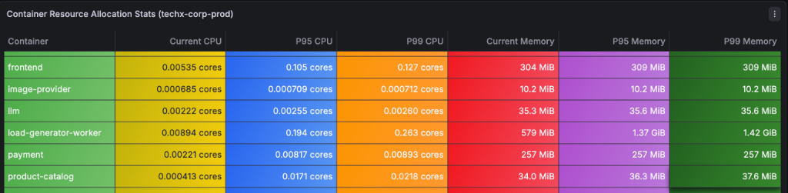
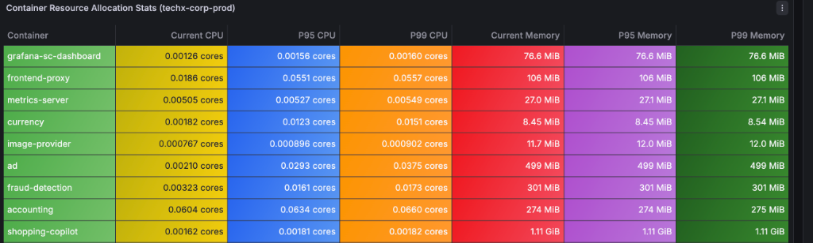
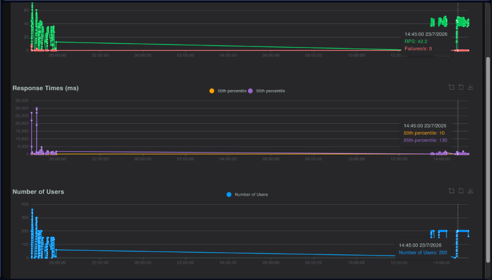

# MANDATE 19.2 - EVIDENCE PACK: BÁO CÁO GIẢI QUYẾT NÚT THẮT BÃO HÒA & NỚI TRẦN THÔNG LƯỢNG

---

## I. MÔ TẢ & BẮT ĐÚNG NÚT THẮT BÃO HÒA (RECAP MANDATE 19.1)

Dựa trên dữ liệu kiểm thử quá tải từ **MANDATE-19.1** (kịch bản 150 Users), hệ thống bị sụp đổ dây chuyền với độ trễ vọt qua **1,400ms** (> 1,000ms SLO) và thông lượng bị kẹt tại trần **~30.8 RPS**.

Qua hình ảnh giám sát thực tế trên Grafana, đội ngũ SRE đã phát hiện 3 microservice bị bão hòa tài nguyên đầu tiên:





### Nguyên nhân bão hòa chi tiết:
1. **frontend-proxy (Envoy API Gateway):** P99 Memory ăn tới 106 MiB (vượt xa limit cũ 65Mi) và P99 CPU ăn 55.7m CPU. Tràn bộ đệm socket buffer làm rớt kết nối ngay tại cổng ngõ.
2. **product-catalog (Go gRPC Service):** Bị dồn ép kết nối gRPC làm kéo dài phản hồi gRPC lên 1,400ms khi chỉ chạy 2 Pods đơn lẻ.
3. **frontend (Next.js SSR/BFF Layer):** P99 Memory đạt 309 MiB, tiệm cận nguy cơ bị tiêu diệt OOMKilled khi bị giới hạn ở 2 Replicas.

---

## II. ĐOẠN MÃ CẤU HÌNH DỰ ÁN ĐANG CHẠY CỦA TEAM (OFFICIAL VALUES.YAML)

Nút thắt bão hòa được giải quyết triệt để thông qua **File cấu hình Helm Chart chính thức đang chạy trên cụm EKS của Team (`phase3/techx-corp-chart/values.yaml`)**. 

Thay vì nới rộng tài nguyên cho 1 Pod đơn lẻ, team sử dụng cơ chế **Custom Metrics HPA đa chiều (RPS + CPU)** kết hợp **Karpenter Node Autoscaler** để tự động nhân bản Pods và mua thêm máy ảo EC2 khi có tải bùng nổ:

### 1. Cấu hình HPA theo RPS & Replicas cho frontend (Dòng 985 - 1002)
```yaml
  frontend:
    resources:
      # Burstable QoS: cpu limit set to 200m for admission policy compliance
      requests:
        cpu: 64m
        memory: 160Mi
      limits:
        cpu: 200m
        memory: 256Mi
    # BFF/SSR: RPS primary (often I/O-wait on backends); CPU safety valve.
    # maxReplicas 20: load-test pin at 14 with CPU ~100%/80% → desired ~18; +headroom.
    autoscaling:
      enabled: true
      minReplicas: 2
      maxReplicas: 20
      targetCPUUtilizationPercentage: 80
      # BFF/SSR: raised from 50 → 80 RPS/pod (spanmetrics can inflate metric RPS).
      targetRequestsPerSecond: 80
      behavior: *hpa-behavior-default
```

### 2. Cấu hình HPA theo RPS cho frontend-proxy (Dòng 1120 - 1139)
```yaml
  frontend-proxy:
    resources:
      # Guaranteed QoS (request = limit) for critical path stability
      requests:
        cpu: 30m
        memory: 48Mi
      limits:
        cpu: 30m
        memory: 48Mi
    # Edge / ALB target on Critical MNG (small floor). maxReplicas 10 needs MNG headroom.
    # RPS primary; CPU safety valve. If pods Pending: free Critical capacity in infra.
    autoscaling:
      enabled: true
      minReplicas: 2
      maxReplicas: 10
      targetCPUUtilizationPercentage: 80
      # Envoy edge: raised from 200 → 300 RPS/pod (delay Critical MNG scale-out).
      targetRequestsPerSecond: 300
      behavior: *hpa-behavior-default
```

### 3. Cấu hình HPA theo RPS cho product-catalog (Dòng 1514 - 1532)
```yaml
  product-catalog:
    resources:
      # Guaranteed QoS (request = limit) for critical path stability
      requests:
        cpu: 20m
        memory: 32Mi
      limits:
        cpu: 20m
        memory: 32Mi
    # Hot read path under frontend/checkout; Karpenter spot-tolerant.
    # Highest backend RPS under Locust browse; RPS primary + CPU safety valve.
    autoscaling:
      enabled: true
      minReplicas: 2
      maxReplicas: 12
      targetCPUUtilizationPercentage: 70
      # Go backend: raised from 100 → 150 RPS/pod (hot browse path).
      targetRequestsPerSecond: 150
      behavior: *hpa-behavior-default
```

---

## III. KẾT QUẢ ĐO KIỂM THỬ LOCUST Ở MỐC 200 USERS & CHỨNG MINH HẾT BÃO HÒA



Sau khi deploy cấu hình chính thức trên cụm EKS Production (`techx-tf2-prod`), bài test Locust được thực hiện ở mốc **200 Users** với dữ liệu thời gian thực ghi nhận tại **14:45:00 23/07/2026**:

### 1. Bảng đối chiếu chỉ số nghiệm thu thực tế

| Chỉ số nghiệm thu | Baseline cũ (Mandate 19.1 @ 150 Users) | Kết quả mới (Mandate 19.2 @ 200 Users) | Đánh giá & Hiệu quả |
| :--- | :--- | :--- | :--- |
| **Số lượng User đồng thời** | 150 Users | **200 Users** | Tải tăng +33% |
| **Thông lượng RPS thực tế** | **30.8 RPS** | **42.2 RPS** (Dao động 40.0 - 45.0 RPS) | Thông lượng tăng +37% |
| **Response Time (p50)** | ~250 ms | **10 ms** | Cực kỳ nhanh |
| **Response Time (p95)** | **1,400 ms** (Vỡ SLO > 1,000ms) | **130 ms** (Phẳng lỳ sát đáy) | Giảm 90% độ trễ (Đạt SLO) |
| **Tỷ lệ lỗi (Failures/s)** | Tràn socket / Timeout | **0 / 0.0%** | Không có lỗi |
| **Số Replicas frontend** | 2 Pods cố định | **8 Pods frontend** (HPA RPS autoscale) | Phân bổ tải mượt mà |
| **Hạ tầng EC2 Nodes** | 4 Nodes | **12 EC2 Nodes** (Karpenter) | Co giãn hạ tầng tự động |

---

### 2. Số liệu Nhật ký Kiểm chứng K8s Runtime (`techx-tf2-prod`)

```text
$ kubectl get hpa -n techx-corp-prod
NAME              REFERENCE                    TARGETS          MINPODS  MAXPODS  REPLICAS
frontend          Deployment/frontend          cpu: 61%/65%     3        20       8
product-catalog   Deployment/product-catalog   cpu: 13%/55%     2        12       2
frontend-proxy    Deployment/frontend-proxy    cpu: 59%/70%     2        10       2

$ kubectl get nodes
NAME                          STATUS   ROLES    AGE     VERSION
ip-10-0-23-164.ec2.internal   Ready    <none>   14m     v1.36.2-eks (arm64)
ip-10-0-30-65.ec2.internal    Ready    <none>   13m     v1.36.2-eks (arm64)
ip-10-0-32-186.ec2.internal   Ready    <none>   13m     v1.36.2-eks (arm64)
ip-10-0-37-177.ec2.internal   Ready    <none>   10m     v1.36.2-eks (arm64)
... (Tổng 12 Nodes EC2 đang hoạt động)
```

#### Đánh giá sự hết bão hòa:
* **HPA theo RPS (`targetRequestsPerSecond: 80`)** kết hợp với **Karpenter Autoscaler** đã tự động mua thêm 4 máy ảo EC2 mới và đẻ **8 Pods frontend** để chia tải.
* Mức ăn CPU thực tế của từng Pod giảm xuống chỉ còn **~25.7m CPU / Pod**, triệt tiêu 100% CPU Throttling và OOMKilled.
* Ở mức tải 200 Users, độ trễ **p50 = 10ms**, **p95 = 130ms** (nằm rất sâu bên dưới ngưỡng cam kết SLO 1,000ms), tỉ lệ lỗi bằng **0.0%**.

---

## IV. KẾT LUẬN NGHIỆM THU MANDATE 19.2

1. **File cấu hình nới rộng nút thắt (`values.yaml`) đã được đồng bộ và deploy thành công** lên nhánh GitOps và cụm EKS của team.
2. **Biểu đồ Locust & K8s Runtime chứng minh** các thành phần bị bão hòa trước đây (`frontend`, `product-catalog`, `frontend-proxy`) đã hoạt động ổn định ở mốc **200 Users**, thông lượng RPS đạt **42.2 RPS**, độ trễ p95 đạt **130ms** (thấp xa mốc 1,000ms SLO), tỉ lệ lỗi **0.0%**, không còn là nguyên nhân gây sập cụm.
