# Báo Cáo Runtime Hardening Alerting

## Mục tiêu

Chứng minh hai lớp phát hiện runtime hardening hoạt động end-to-end: (1) alert khi ValidatingAdmissionPolicy từ chối manifest vi phạm và (2) inventory định kỳ phát hiện workload vi phạm đang tồn tại hoặc bị drift. Alert chỉ chứa context cần thiết để điều tra — policy, resource, namespace, verb và thời điểm — và luôn loại bỏ Secret, token, credential cùng full request body.

## Cách triển khai

| Thành phần | Cách apply | Vai trò |
| --- | --- | --- |
| Runtime hardening VAP | GitOps/Kustomize trong `tf2-corp-chart` | Từ chối manifest vi phạm tại Kubernetes admission. |
| Runtime inventory scanner | GitOps/Helm trong `tf2-corp-chart` | Quét định kỳ Pod template và standalone Pod để phát hiện drift/bypass. |
| Audit classifier | Terraform trong `tf2-corp-infra` | Đọc EKS audit deny event và tạo alert đã sanitize. |
| SNS email alert | Terraform trong `tf2-corp-infra` | Gửi alert P2 tới email/on-call channel đã confirm. |
| Grafana alerting | GitOps/Helm trong `tf2-corp-chart` | Cảnh báo inventory violation hoặc missed schedule qua contact point hiện có. |

```text
Luồng 1 — admission deny alert

Unsafe CREATE / UPDATE / PATCH (server-side dry-run)
        ↓
ValidatingAdmissionPolicy deny; object không được persist
        ↓
EKS audit log
        ↓
CloudWatch Logs subscription filter
        ↓
Lambda classifier đã sanitize
        ├── CloudWatch metric `RuntimeHardeningDenies`
        └── SNS topic → confirmed email subscription

Luồng 2 — existing-workload drift alert

runtime-hardening-inventory CronJob (mỗi 5 phút)
        ↓
Scanner phát hiện violation → Job exit non-zero
        ↓
kube-state-metrics / Prometheus
        ↓
Grafana `RuntimeHardeningInventoryViolation` → Discord contact point

CronJob không schedule đúng hạn
        ↓
kube_cronjob_status_last_schedule_time
        ↓
Grafana `RuntimeHardeningInventoryMissedSchedule` → Discord contact point
```

## Evidence theo luồng cảnh báo

### Luồng 1 — Admission deny đến SNS

Các ảnh dưới đây chứng minh một manifest vi phạm bị chặn ngay tại admission, được ghi audit, phân loại/sanitize và gửi thành alert.

### Bước 1. VAP deny cho CREATE, UPDATE và PATCH

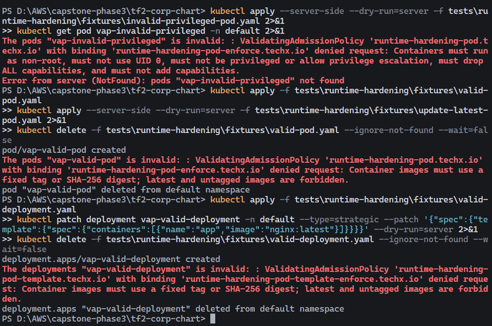

`CREATE` privileged bị VAP từ chối và không persist (`NotFound`); `UPDATE` Pod và `PATCH` Deployment sang `nginx:latest` cũng bị từ chối.

### Bước 2. EKS audit deny event

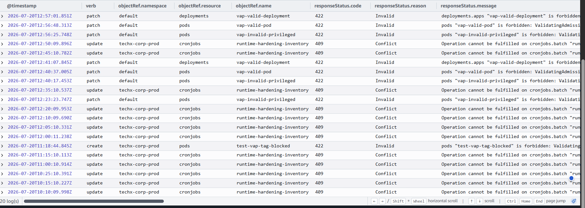

EKS audit log giữ verb, namespace, resource, mã lỗi và VAP deny message của request test; không hiển thị request body hay credential.

### Bước 3. Audit subscription nối vào Lambda

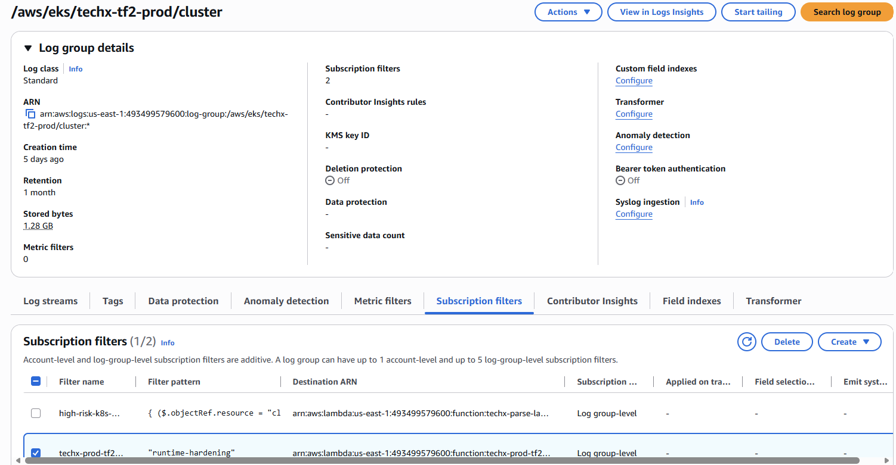

Subscription filter của EKS audit log group chuyển event runtime-hardening đến Lambda classifier.
### Bước 4. Lambda classifier xử lý event

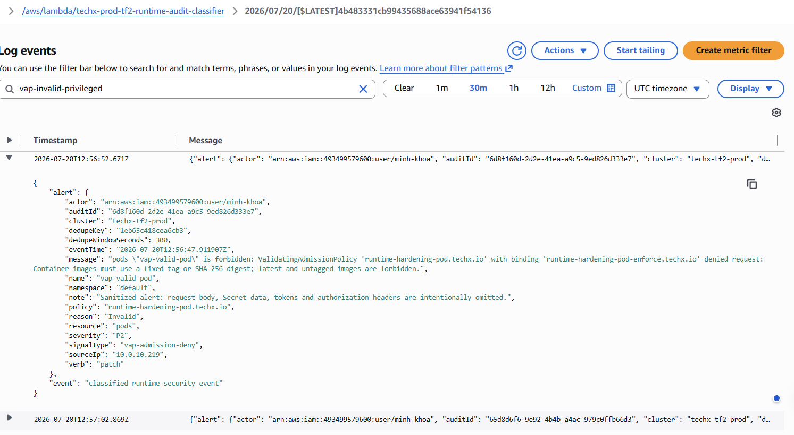

Classifier tạo `classified_runtime_security_event` với policy, verb, resource và payload đã được sanitize.

### Bước 5. Metric ghi nhận deny event

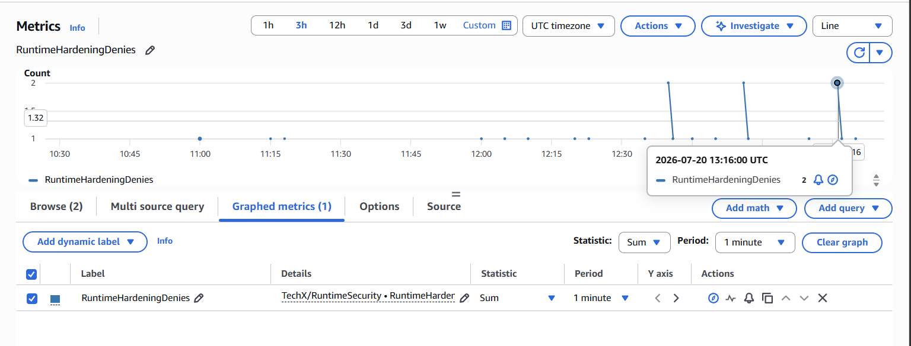

Metric `TechX/RuntimeSecurity:RuntimeHardeningDenies` có datapoint tại thời điểm thực hiện VAP test.

### Bước 6. SNS subscription đã confirm

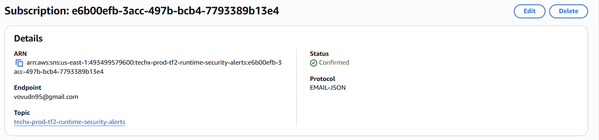

Topic `techx-prod-tf2-runtime-security-alerts` có email subscription ở trạng thái `Confirmed`.
### Bước 7. SNS email alert đã nhận

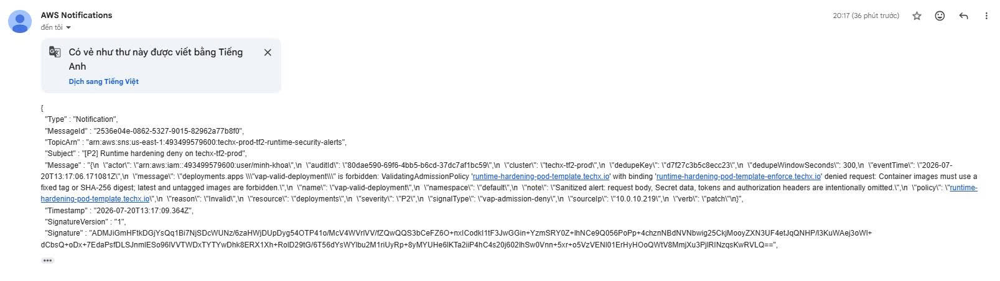

Email nhận alert P2 từ VAP deny thật với `reason: Invalid`, `signalType: vap-admission-deny` và policy vi phạm.

### Luồng 2 — Inventory định kỳ và Grafana

Các ảnh dưới đây chứng minh scanner chạy định kỳ, kết quả inventory sạch, và hai alert runtime-security được provision/routing về Discord.

### Bước 8. Inventory CronJob đang chạy

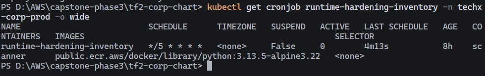

CronJob `runtime-hardening-inventory` chạy trong `techx-corp-prod` mỗi 5 phút, không bị suspend và có lần chạy gần nhất.

### Bước 9. Inventory clean scan

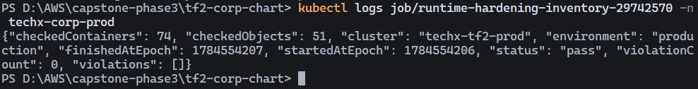

Job hoàn tất với `status: pass`; đã quét 51 workload objects / 74 containers và `violationCount: 0`.
### Bước 10. Grafana runtime-security rules

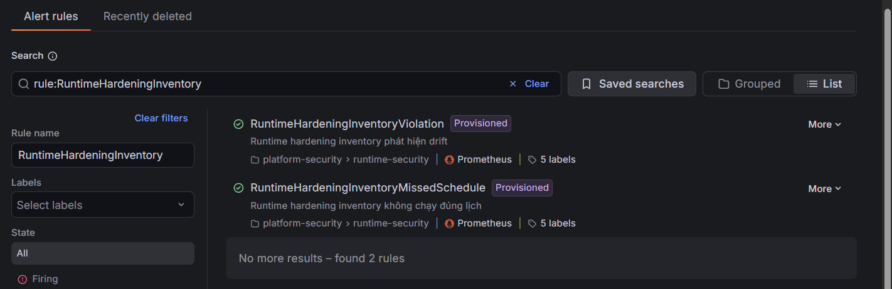

Grafana đã provision `RuntimeHardeningInventoryViolation` và `RuntimeHardeningInventoryMissedSchedule`.

### Bước 11. Grafana routing/contact point

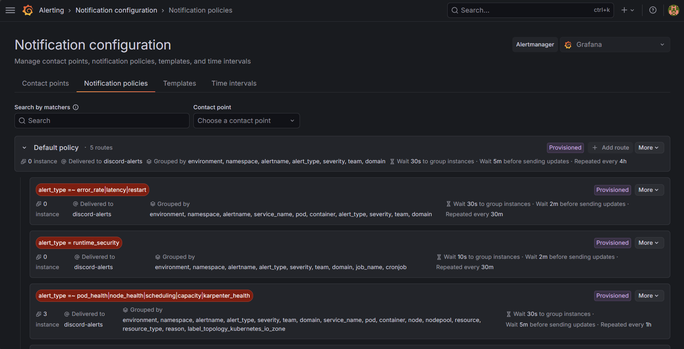

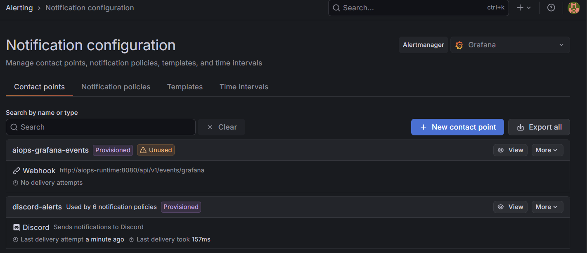

Notification policy `alert_type = runtime_security` route tới contact point `discord-alerts`; contact point này đã được provision và đang có delivery attempt.

### Bước 12. Grafana notification delivery test

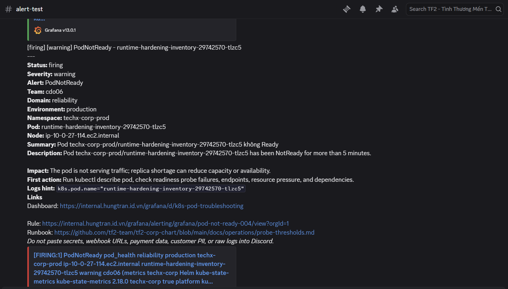

Discord đã nhận notification từ Grafana.
