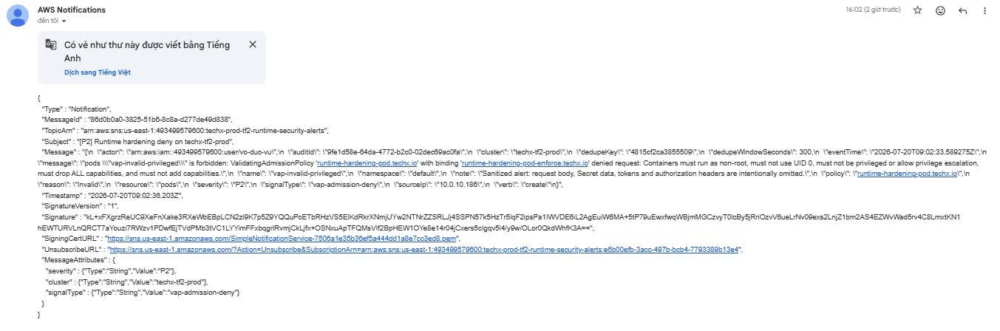
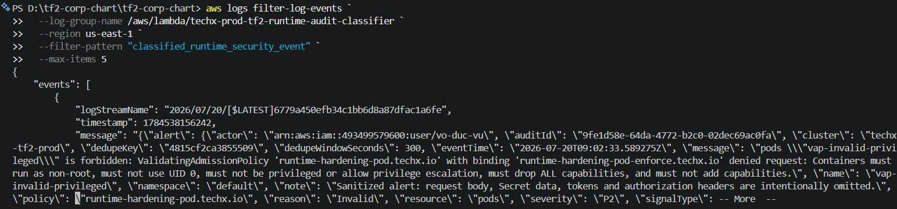
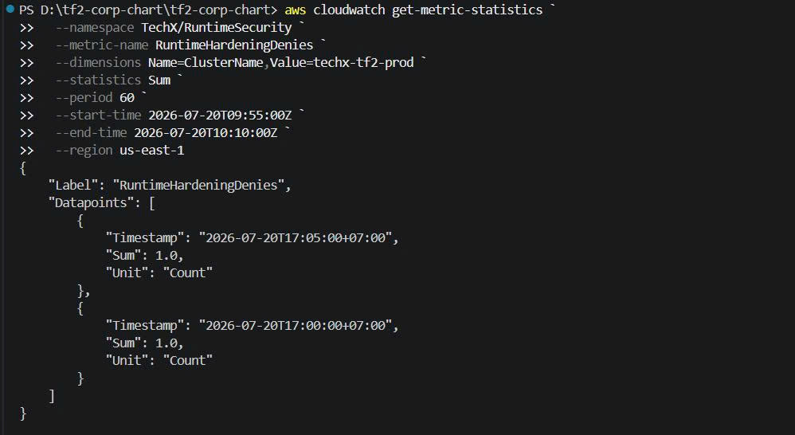
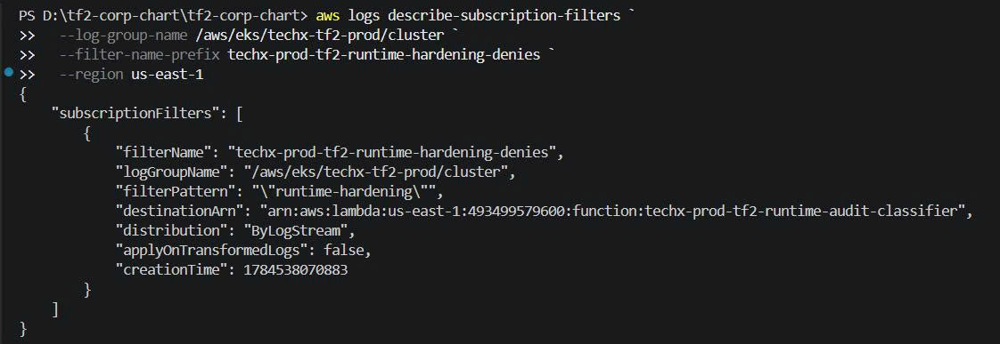
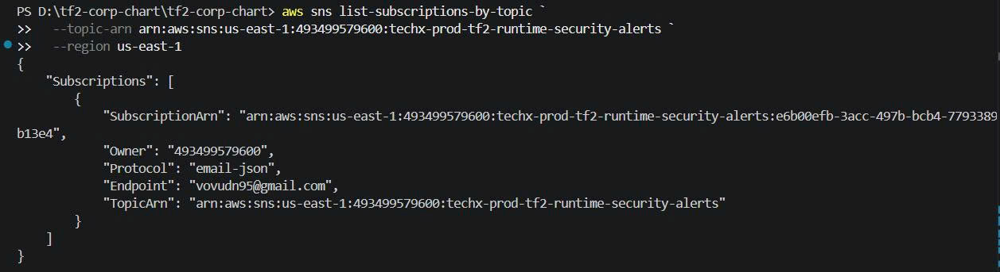

# Báo Cáo Runtime Hardening Alerting

Cluster: `techx-tf2-prod`  
Namespace chính: `techx-corp-prod`  
Trạng thái: đã apply và kiểm chứng trên production

## Mục Tiêu

Triển khai alert cho Mandate 05 để phát hiện khi có manifest hoặc workload vi
phạm runtime hardening, đặc biệt là các hành vi như chạy privileged, dùng host
access, thiếu hardening security context hoặc bị admission policy từ chối.

## Cách Triển Khai

Alerting được triển khai bằng hai phần:

| Thành phần                | Cách apply                         | Vai trò                                                   |
| ------------------------- | ---------------------------------- | --------------------------------------------------------- |
| Runtime hardening policy  | GitOps/Helm trong `tf2-corp-chart` | Chặn manifest vi phạm bằng Kubernetes admission           |
| Runtime inventory scanner | GitOps/Helm trong `tf2-corp-chart` | Quét định kỳ workload đang tồn tại để phát hiện drift     |
| Audit classifier          | Terraform trong `tf2-corp-infra`   | Đọc EKS audit log, phân loại deny event runtime-hardening |
| SNS email alert           | Terraform trong `tf2-corp-infra`   | Gửi cảnh báo tới email đã confirm                         |
| CloudWatch alarm          | Terraform trong `tf2-corp-infra`   | Theo dõi lỗi của Lambda classifier                        |

Luồng alert chính:

```text
Manifest vi phạm
-> ValidatingAdmissionPolicy deny
-> EKS audit log
-> CloudWatch Logs subscription
-> Lambda classifier
-> SNS
-> Email alert
```

Luồng kiểm tra drift:

```text
CronJob runtime-hardening-inventory
-> đọc workload trong cluster bằng quyền read-only
-> kiểm tra theo runtime-hardening rules và exception đã duyệt
-> ghi kết quả pass/fail ra log
```

## Kết Quả Kiểm Chứng

| Hạng mục                  | Kết quả | Evidence                                                                           |
| ------------------------- | ------- | ---------------------------------------------------------------------------------- |
| SNS email alert           | Pass    | Email `[P2] Runtime hardening deny on techx-tf2-prod` đã nhận được                 |
| Lambda audit classifier   | Pass    | Lambda log có `classified_runtime_security_event`                                  |
| CloudWatch metric         | Pass    | Metric `TechX/RuntimeSecurity RuntimeHardeningDenies` có datapoint khi test deny   |
| Audit log subscription    | Pass    | CloudWatch Logs subscription filter trỏ tới Lambda classifier                      |
| SNS subscription          | Pass    | Email subscription đã confirm                                                      |
| Alert trigger             | Pass    | Manifest privileged bị deny bởi `runtime-hardening-pod.techx.io` để tạo test event |
| Runtime inventory scanner | Pass    | Job mới nhất `Complete`, log có `"status": "pass"` và `"violationCount": 0`        |

## Evidence Đính Kèm

### 1. Email alert đã nhận



### 2. Lambda classifier xử lý event



### 3. Metric ghi nhận deny event



### 4. Audit log subscription nối vào Lambda



### 5. SNS subscription đã confirm



## Kết Luận

Runtime hardening alerting đã được apply và kiểm chứng trên production. Hệ thống
hiện có admission policy để chặn manifest vi phạm, inventory scanner để phát
hiện drift, và email alert khi có request bị deny bởi runtime-hardening policy.
