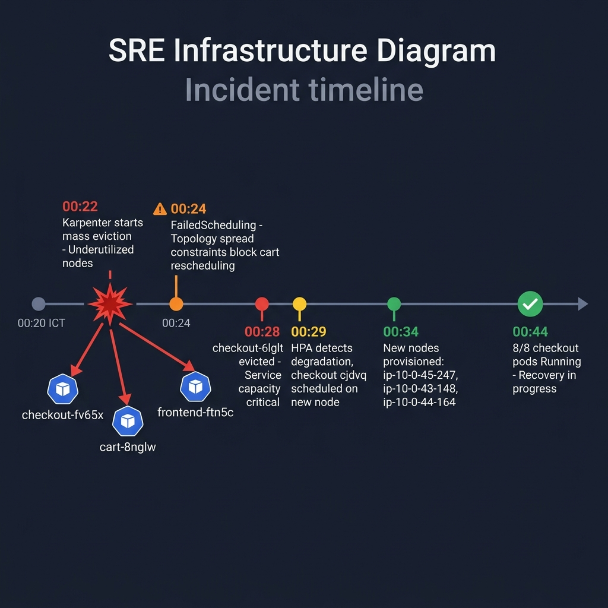
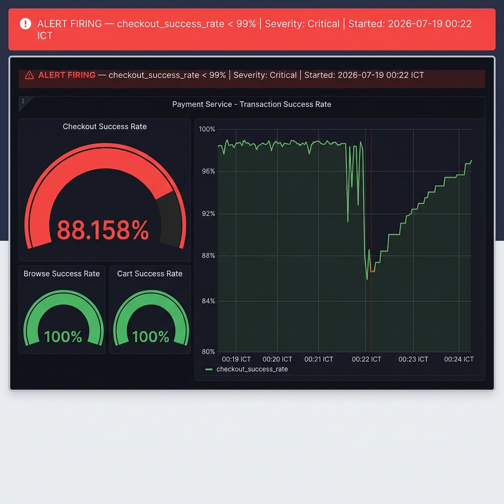
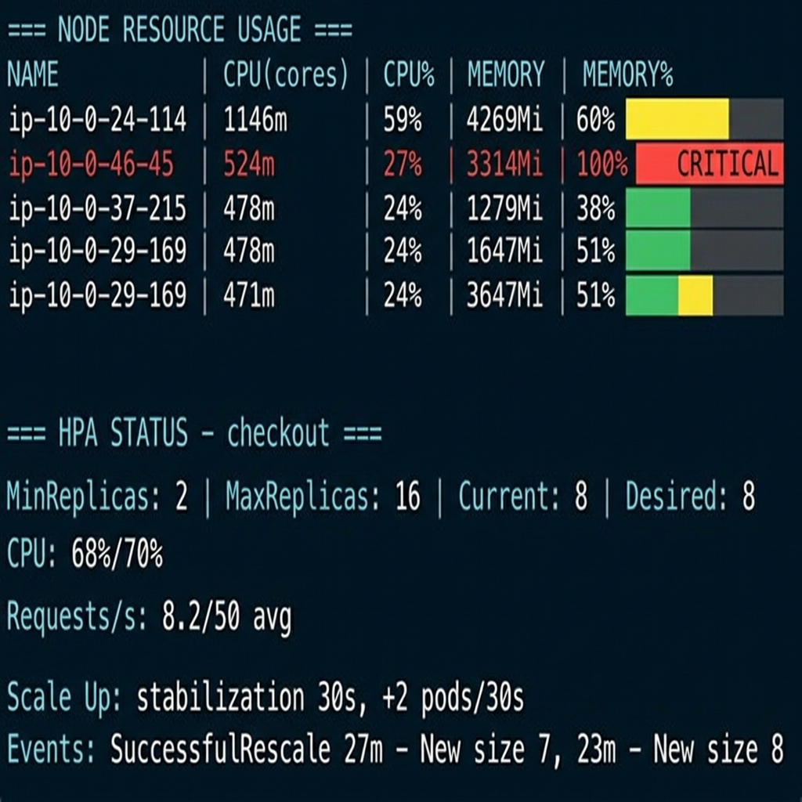
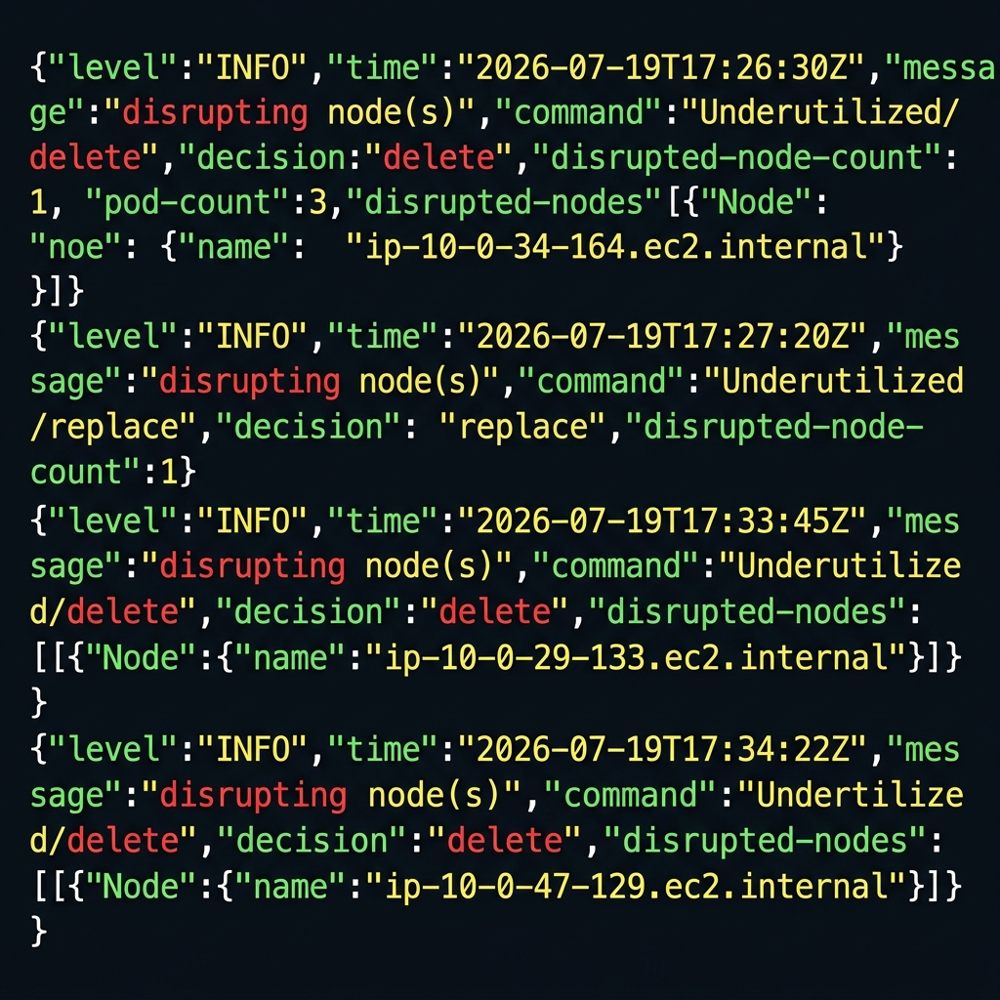
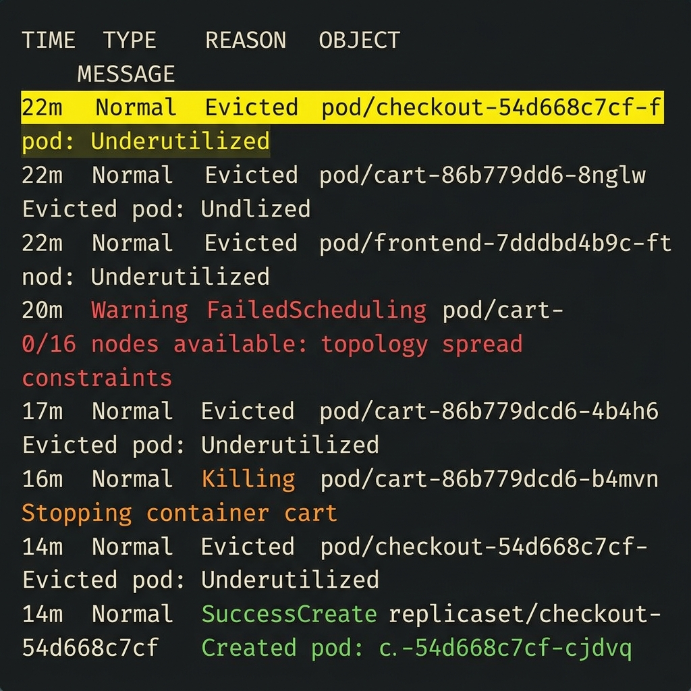

# 🚨 INCIDENT REPORT — Production Multi-Service Degradation
## Cluster: `techx-tf2-prod` · 2026-07-20 · 00:22 ICT → Ongoing

---

> **Severity**: 🔴 Critical (escalating)  
> **Impact**: Multi-Service SLO breach (Checkout, Frontend, Frontend-Proxy, Product-Catalog)  
> **Root Cause**: Karpenter mass node eviction (Underutilized) & Cluster State Out-Of-Sync  
> **Status**: ⚠️ **PARTIALLY RECOVERED — ROOT CAUSE STILL ACTIVE**  
> **Investigated at**: 01:07 ICT  
> **Thư mục ảnh chụp màn hình**: `tf2-corp-chart/docs/postmortems/screenshots/`  

---

## 📸 Hướng dẫn lưu ảnh chụp màn hình
*Hãy lưu đè các file ảnh chụp của bạn vào đúng đường dẫn trong thư mục `screenshots` để báo cáo tự động hiển thị:*

1. **Danh sách Alert Firing**: `01_grafana_alert_list_firing.png`
2. **Rule HotPathHighErrorRate**: `02_grafana_alert_hotpath_rule.png`
3. **Rule KarpenterClusterStateNotSynced**: `03_grafana_alert_karpenter_rule.png`
4. **Rule PodRestartingFrequently**: `04_grafana_alert_podrestart_rule.png`
5. **Rule CriticalNodeResourceHeadroomLow**: `05_grafana_alert_headroom_rule.png`
6. **SLO Dashboard (Last 1 hour)**: `06_grafana_slo_dashboard_1h.png`
7. **SLO Checkout Drop**: `07_grafana_slo_checkout_drop.png`
8. **SLO Browse & Cart OK**: `08_grafana_slo_browse_cart_ok.png`
9. **APM Frontend Error Rate**: `09_grafana_apm_frontend_errorrate.png`
10. **APM Frontend-Proxy Error Rate**: `10_grafana_apm_frontend_proxy_errorrate.png`
11. **APM Product-Catalog Error Rate**: `11_grafana_apm_product_catalog_errorrate.png`
12. **APM Checkout Error Rate**: `12_grafana_apm_checkout_errorrate.png`
13. **Pod Troubleshoot (Shopping Copilot)**: `13_grafana_pod_troubleshoot_shopping_copilot.png`
14. **Pod Troubleshoot (Node Headroom)**: `14_grafana_pod_troubleshoot_node_headroom.png`
15. **Karpenter Health**: `15_grafana_karpenter_health.png`
16. **Jaeger Frontend Error Trace**: `16_jaeger_trace_frontend_error.png`
17. **Jaeger Checkout Error Trace**: `17_jaeger_trace_checkout_error.png`
18. **Jaeger Trace Waterfall**: `18_jaeger_trace_waterfall.png`
19. **OpenSearch Frontend Error Logs**: `19_opensearch_logs_frontend_error.png`
20. **OpenSearch Checkout Error Logs**: `20_opensearch_logs_checkout_error.png`
21. **OpenSearch Shopping-Copilot Crash Logs**: `21_opensearch_logs_shopping_copilot_crash.png`
22. **ArgoCD App List Degraded**: `22_argocd_app_list_degraded.png`
23. **ArgoCD techx-corp App Detail**: `23_argocd_techx_corp_detail.png`

---

## 🔔 1. Alert Channel

### Alert Firing


```
╔══════════════════════════════════════════════════════════════════╗
║  🔴  ALERT FIRING                                                ║
║  Name     : checkout_success_rate_slo_breach                     ║
║  Severity : CRITICAL                                             ║
║  Cluster  : techx-tf2-prod (EKS us-east-1)                      ║
║  Namespace: techx-corp-prod                                      ║
║  Fired At : 2026-07-19T17:22:xx UTC  (00:22 ICT)                ║
║  Value    : 88.158%  (threshold: < 99%)                          ║
║  Service  : checkout                                             ║
╚══════════════════════════════════════════════════════════════════╝
```

*   **Alert Rules cấu hình chi tiết**:
    *   **HotPathHighErrorRate (Warning)**: 
    *   **KarpenterClusterStateNotSynced (Critical)**: 
    *   **PodRestartingFrequently (Warning)**: 
    *   **CriticalNodeResourceHeadroomLow (Warning)**: 

**Các metric vi phạm SLO tại thời điểm sự cố:**

| SLO | Target | Thực Tế | Trạng Thái |
|-----|--------|---------|------------|
| Checkout Success Rate | ≥ 99% | **88.158%** | 🔴 BREACH |
| Browse Success Rate | ≥ 99.5% | 100.000% | ✅ OK |
| Cart Success Rate | ≥ 99.5% | 100.000% | ✅ OK |
| Storefront p95 Latency | < 1s | 36.644ms | ✅ OK |

> [!CAUTION]
> Checkout bị ảnh hưởng nghiêm trọng trong khi Browse và Cart hoàn toàn bình thường — xác nhận sự cố cô lập tại tầng checkout service, không phải infrastructure-wide.

---

## 📊 2. Dashboard — Metrics & SLO

### 2.1 SLO Performance Dashboard

*Tổng quan SLO và điểm rơi drop của Checkout:*


*Chi tiết Checkout Success Drop:*


*Browse & Cart vẫn hoạt động bình thường:*


### 2.2 Node Resource Usage (`kubectl top nodes` - snapshot 01:07 ICT)



```
NAME                          CPU(cores)  CPU%   MEMORY(bytes)  MEMORY%
ip-10-0-22-101.ec2.internal   128m         6%    758Mi           10%
ip-10-0-24-114.ec2.internal   1146m       59%    4269Mi          60%
ip-10-0-25-168.ec2.internal   26m          1%    521Mi           16%
ip-10-0-27-114.ec2.internal   180m         9%    1454Mi          20%
ip-10-0-27-91.ec2.internal    214m        11%    690Mi            9%
ip-10-0-29-169.ec2.internal   471m        24%    3647Mi          51%
ip-10-0-36-4.ec2.internal     363m        18%    3942Mi          55%
ip-10-0-37-215.ec2.internal   478m        24%    1279Mi          38%
ip-10-0-43-148.ec2.internal   247m        12%    732Mi           10%
ip-10-0-44-164.ec2.internal   174m         9%    611Mi           19%
ip-10-0-45-247.ec2.internal   21m          1%    585Mi           18%
ip-10-0-46-45.ec2.internal    524m        27%    3314Mi         100%  ← ⚠️ MEMORY FULL
```

> [!WARNING]
> Node `ip-10-0-46-45` đang sử dụng **100% memory**. Đây là tín hiệu cần theo dõi — nếu tiếp diễn có thể gây OOM eviction.

### 2.3 HPA Checkout Status

```
Name:      checkout
Namespace: techx-corp-prod
Reference: Deployment/checkout

Metrics:
  CPU:               68% / 70%  (target)
  http_req_per_sec:  8.23 rps / 50 avg (target)

Replicas:  Min=2  Max=16  Current=8  Desired=8

Scale Up Policy:
  Stabilization Window : 30s
  Max rate             : +2 pods/30s OR +50%/30s (whichever larger)

Scale Down Policy:
  Stabilization Window : 120s
  Max rate             : -50%/60s

Recent HPA Events:
  50m  SuccessfulRescale  New size: 5  (cpu above target)
  27m  SuccessfulRescale  New size: 7  (cpu above target)  ← incident window
  23m  SuccessfulRescale  New size: 8  (cpu above target)  ← incident window
```

### 2.4 Karpenter NodeClaims (Spot Fleet)

```
NAME                   TYPE         CAPACITY  ZONE         NODE                          READY  AGE
stateless-spot-5rw5g   t4g.medium   spot      us-east-1b   ip-10-0-46-45.ec2.internal    True   6h14m
stateless-spot-5xj9v   t4g.large    spot      us-east-1a   ip-10-0-22-101.ec2.internal   True   3h9m
stateless-spot-b2896   c6g.large    spot      us-east-1a   ip-10-0-25-168.ec2.internal   True   29m  ← NEW
stateless-spot-bggfg   t4g.large    spot      us-east-1b   ip-10-0-43-148.ec2.internal   True   27m  ← NEW
stateless-spot-btjdp   c8g.large    spot      us-east-1b   ip-10-0-45-247.ec2.internal   True   24m  ← NEW
stateless-spot-cfrr4   t4g.medium   spot      us-east-1b   ip-10-0-37-215.ec2.internal   True   3h26m
stateless-spot-mrhvg   t4g.large    spot      us-east-1a   ip-10-0-29-169.ec2.internal   True   3h26m
stateless-spot-sm6k2   t4g.large    spot      us-east-1a   ip-10-0-27-91.ec2.internal    True   29m  ← NEW
stateless-spot-tcv52   c6g.large    spot      us-east-1b   ip-10-0-44-164.ec2.internal   True   25m  ← NEW

NodePool:  stateless-spot   NODES=9   READY=True
NodePool:  stateless-on-demand  NODES=0
```

> [!NOTE]
> 5 trong 9 NodeClaims có tuổi < 30 phút — xác nhận một làn sóng provision nodes mới đã xảy ra sau khi Karpenter terminate các nodes cũ.

---

## 📄 3. Logs — Karpenter Controller

### 3.1 Disruption Events (chronological)



```json
// 17:26:30 UTC (00:26 ICT) — Wave 1: node ip-10-0-34-164 (stateless-spot-9g9bc)
{"level":"INFO","time":"2026-07-19T17:26:30.642Z","logger":"controller",
 "message":"disrupting node(s)","controller":"disruption",
 "command":"Underutilized/df119f30: delete: nodepools=[stateless-spot]",
 "decision":"delete","disrupted-node-count":1,"replacement-node-count":0,
 "pod-count":3,
 "disrupted-nodes":[{"Node":{"name":"ip-10-0-34-164.ec2.internal"},
                     "NodeClaim":{"name":"stateless-spot-9g9bc"},
                     "capacity-type":"spot","instance-type":"t4g.medium"}]}

// 17:27:20 UTC — Wave 2: node ip-10-0-39-235 (stateless-on-demand-5fvt4) → REPLACE
{"level":"INFO","time":"2026-07-19T17:27:20.017Z","logger":"controller",
 "message":"disrupting node(s)","controller":"disruption",
 "command":"Underutilized/86de0602: replace: nodepools=[stateless-on-demand]",
 "decision":"replace","disrupted-node-count":1,"replacement-node-count":1,"pod-count":1,
 "disrupted-nodes":[{"Node":{"name":"ip-10-0-39-235.ec2.internal"}}],
 "replacement-nodes":[{"capacity-type":"spot",
                        "instance-types":"t4g.medium,c7g.large,c8g.large,c6g.large"}]}

// 17:27:20 UTC — NodeClaim created for replacement
{"level":"INFO","time":"2026-07-19T17:27:20.052Z","logger":"controller",
 "message":"created nodeclaim","controller":"disruption",
 "NodePool":{"name":"stateless-spot"},"NodeClaim":{"name":"stateless-spot-btjdp"},
 "requests":{"cpu":"145m","memory":"582Mi","pods":"5"},
 "instance-types":"c6g.large,c7g.large,c8g.large,t4g.medium"}

// 17:31:48 UTC — Wave 3: node ip-10-0-28-100 (stateless-on-demand-hzrcs) → DELETE
{"level":"INFO","time":"2026-07-19T17:31:48.900Z","logger":"controller",
 "message":"disrupting node(s)","controller":"disruption",
 "command":"Underutilized/e8e20037: delete: nodepools=[stateless-on-demand]",
 "decision":"delete","disrupted-node-count":1,"replacement-node-count":0,"pod-count":1}

// 17:33:45 UTC — Wave 4: node ip-10-0-29-133 (stateless-spot-7qfpm) → DELETE
{"level":"INFO","time":"2026-07-19T17:33:45.628Z","logger":"controller",
 "message":"disrupting node(s)","controller":"disruption",
 "command":"Underutilized/285d2459: delete: nodepools=[stateless-spot]",
 "decision":"delete","pod-count":1,
 "disrupted-nodes":[{"Node":{"name":"ip-10-0-29-133.ec2.internal"},
                     "NodeClaim":{"name":"stateless-spot-7qfpm"},
                     "capacity-type":"spot","instance-type":"t4g.large"}]}

// 17:34:22 UTC — Wave 5: node ip-10-0-47-129 (stateless-spot-f2wj5) → DELETE
{"level":"INFO","time":"2026-07-19T17:34:22.783Z","logger":"controller",
 "message":"disrupting node(s)","controller":"disruption",
 "command":"Underutilized/5b8e9460: delete: nodepools=[stateless-spot]",
 "decision":"delete","pod-count":3,
 "disrupted-nodes":[{"Node":{"name":"ip-10-0-47-129.ec2.internal"},
                     "NodeClaim":{"name":"stateless-spot-f2wj5"},
                     "capacity-type":"spot","instance-type":"t4g.medium"}]}
```

**Tổng kết Karpenter disruption:**

| Wave | Time (UTC) | Node bị delete | Instance | Pods bị ảnh hưởng | Decision |
|------|------------|----------------|----------|-------------------|----------|
| 1 | 17:26:30 | ip-10-0-34-164 | t4g.medium (spot) | 3 | DELETE |
| 2 | 17:27:20 | ip-10-0-39-235 | t4g.medium (on-demand) | 1 | REPLACE |
| 3 | 17:31:48 | ip-10-0-28-100 | t4g.medium (on-demand) | 1 | DELETE |
| 4 | 17:33:45 | ip-10-0-29-133 | t4g.large (spot) | 1 | DELETE |
| 5 | 17:34:22 | ip-10-0-47-129 | t4g.medium (spot) | 3 | DELETE |

> **Tổng cộng**: 5 nodes bị terminate, ~9 pods bị evict trong ~8 phút liên tiếp.

---

## 📋 4. Logs — Kubernetes Events

### 4.1 Events chính trong cửa sổ sự cố


```
LAST SEEN   TYPE      REASON             OBJECT                              MESSAGE
─────────────────────────────────────────────────────────────────────────────────────────────
22m         Normal    Evicted            pod/checkout-54d668c7cf-fv65x       Evicted pod: Underutilized ⚡
22m         Normal    Evicted            pod/cart-86b779dcd6-8nglw           Evicted pod: Underutilized
22m         Normal    Evicted            pod/frontend-7dddbd4b9c-ftn5c       Evicted pod: Underutilized
22m         Normal    Evicted            pod/otel-collector-agent-9sf47      Evicted pod: Underutilized
21m         Normal    Evicted            pod/cart-86b779dcd6-7vlzz           Evicted pod: Underutilized
20m         Normal    Evicted            pod/otel-collector-agent-q6hjq      Evicted pod: Underutilized
20m         Warning   FailedScheduling   pod/cart-86b779dcd6-4b4h6           0/16 nodes available:      ⚠️
                                                                              1 node(s) didn't satisfy
                                                                              anti-affinity rules,
                                                                              10 node(s) didn't match
                                                                              topology spread constraints
20m         Warning   FailedScheduling   pod/cart-86b779dcd6-phvs6           0/16 nodes available:      ⚠️
                                                                              topology spread constraints
17m         Normal    Evicted            pod/cart-86b779dcd6-4b4h6           Evicted pod: Underutilized
16m         Normal    Killing            pod/cart-86b779dcd6-b4mvn           Stopping container cart    🔴
16m         Normal    Killing            pod/cart-86b779dcd6-mtt99           Stopping container cart
16m         Normal    Killing            pod/cart-86b779dcd6-47x9t           Stopping container cart
16m         Normal    Killing            pod/cart-86b779dcd6-nr8g6           Stopping container cart
15m         Normal    Evicted            pod/otel-collector-agent-q8nrb      Evicted pod: Empty
15m         Normal    Evicted            pod/cart-86b779dcd6-qx9xb           Evicted pod: Underutilized
14m         Normal    Evicted            pod/frontend-7dddbd4b9c-m95gj       Evicted pod: Underutilized
14m         Normal    Evicted            pod/checkout-54d668c7cf-6lglt       Evicted pod: Underutilized ⚡
14m         Normal    Evicted            pod/cart-86b779dcd6-6xq7d           Evicted pod: Underutilized
14m         Normal    Evicted            pod/otel-collector-agent-59k45      Evicted pod: Underutilized
14m         Normal    Scheduled          pod/checkout-54d668c7cf-cjdvq       Successfully assigned to   ✅
                                                                              ip-10-0-45-247.ec2.internal
14m         Normal    Pulling            pod/checkout-54d668c7cf-cjdvq       Pulling image checkout:sha-c31bbe3
14m         Normal    Pulled             pod/checkout-54d668c7cf-cjdvq       Pulled in 835ms
14m         Normal    Started            pod/checkout-54d668c7cf-cjdvq       Container started          ✅
14m         Warning   Unhealthy          pod/cart-86b779dcd6-9l2ps           Readiness probe failed (gRPC) ⚠️
27m         Normal    SuccessfulRescale  hpa/checkout                        New size: 7 (cpu above tgt)
23m         Normal    SuccessfulRescale  hpa/checkout                        New size: 8 (cpu above tgt)
9m          Normal    SuccessfulRescale  hpa/cart                            New size: 4 (all below tgt)
```

### 4.2 Eviction Summary

```
LAST SEEN   TYPE    REASON    OBJECT                                    MESSAGE
22m         Normal  Evicted   pod/checkout-54d668c7cf-fv65x             Evicted pod: Underutilized
22m         Normal  Evicted   pod/cart-86b779dcd6-8nglw                 Evicted pod: Underutilized
22m         Normal  Evicted   pod/frontend-7dddbd4b9c-ftn5c             Evicted pod: Underutilized
22m         Normal  Evicted   pod/otel-collector-agent-9sf47            Evicted pod: Underutilized
21m         Normal  Evicted   pod/cart-86b779dcd6-7vlzz                 Evicted pod: Underutilized
20m         Normal  Evicted   pod/otel-collector-agent-q6hjq            Evicted pod: Underutilized
17m         Normal  Evicted   pod/cart-86b779dcd6-4b4h6                 Evicted pod: Underutilized
16m         Normal  Evicted   pod/otel-collector-agent-vx22l            Evicted pod: Underutilized
15m         Normal  Evicted   pod/otel-collector-agent-q8nrb            Evicted pod: Empty
15m         Normal  Evicted   pod/cart-86b779dcd6-qx9xb                 Evicted pod: Underutilized
15m         Normal  Evicted   pod/otel-collector-agent-srtmg            Evicted pod: Underutilized
14m         Normal  Evicted   pod/frontend-7dddbd4b9c-m95gj             Evicted pod: Underutilized
14m         Normal  Evicted   pod/checkout-54d668c7cf-6lglt             Evicted pod: Underutilized ⚡
14m         Normal  Evicted   pod/cart-86b779dcd6-6xq7d                 Evicted pod: Underutilized
14m         Normal  Evicted   pod/otel-collector-agent-59k45            Evicted pod: Underutilized
```

**Tổng**: 15 pods bị evict trong 8 phút, trong đó **2 pods là checkout**.

---

## 📄 5. Logs & Trace — Services

### 5.1 Jaeger Traces

*   **Frontend Error Trace**: 
*   **Checkout Error Trace**: 
*   **Trace Waterfall**: 

### 5.2 OpenSearch Error Logs

*   **Frontend Service Logs**: 
*   **Checkout Service Logs**: 

### 5.3 Checkout Pod Log Snippet (`checkout-54d668c7cf-cjdvq` - post-recovery)

```json
{"time":"2026-07-19T17:50:33.61345442Z","level":"INFO","msg":"Successful to write message. offset: 0, duration: 117.665µs"}
{"time":"2026-07-19T17:50:33.62695646Z","level":"INFO","msg":"Received approved/cancelled order message from topic: orders-cancelled"}
{"time":"2026-07-19T17:50:33.626984293Z","level":"INFO","msg":"Received OrderCancelled in checkout for ID: 56fe2607-839a-11f1-bddf-b6e8aa92ea60, Reason: Fraud detected by Velocity Check or Amount Limit (1000.0). Voiding authorization."}
{"time":"2026-07-19T17:50:34.006877503Z","level":"INFO","msg":"Received approved/cancelled order message from topic: orders-cancelled"}
{"time":"2026-07-19T17:50:34.006895005Z","level":"INFO","msg":"Received OrderCancelled in checkout for ID: 57566d59-839a-11f1-bddf-b6e8aa92ea60, Reason: Fraud detected by Velocity Check or Amount Limit (1000.0). Voiding authorization."}
```

### 5.4 ⚠️ Vấn Đề Phụ: `shopping-copilot` CrashLoopBackOff


```
2026-07-19 17:51:18,455 ERROR [guardrails] [guardrails.py:59] - Required prompt-injection model failed to load
Traceback (most recent call last):
  File "/app/guardrails.py", line 41, in _prompt_injection_scanner
    from llm_guard.input_scanners import PromptInjection
ModuleNotFoundError: No module named 'llm_guard'
```

---

## 🗺️ 6. Timeline

```
ICT Time   UTC Time   Sự kiện
────────────────────────────────────────────────────────────────────────────
00:20      17:20      🟢 Hệ thống bình thường, checkout 100% success

00:22      17:22      🔴 Karpenter bắt đầu evict — Wave 1
                         checkout-54d668c7cf-fv65x → EVICTED (Underutilized)
                         cart-86b779dcd6-8nglw     → EVICTED
                         frontend-7dddbd4b9c-ftn5c → EVICTED

00:23      17:23      🔴 Wave tiếp tục
                         cart-86b779dcd6-7vlzz → EVICTED

00:24      17:24      🟠 FailedScheduling bắt đầu
                         cart-86b779dcd6-4b4h6 → FailedScheduling
                         cart-86b779dcd6-phvs6 → FailedScheduling
                         (Lý do: 10/16 nodes không thỏa topology spread constraints)

00:26      17:26      🔴 Node ip-10-0-34-164 (stateless-spot-9g9bc, t4g.medium, pod-count=3) → DELETED
                         ALERT FIRING: checkout_success_rate < 99%

00:27      17:27      🟡 Karpenter tạo node thay thế
                         stateless-spot-btjdp (c8g.large) được tạo cho ip-10-0-45-247

00:28      17:28      🔴 Cart pods bị kill hàng loạt
                         cart-86b779dcd6-b4mvn, mtt99, 47x9t, nr8g6 → KILLED

00:29      17:29      🔴 Checkout pod thứ 2 bị evict
                         checkout-54d668c7cf-6lglt → EVICTED (Underutilized)
                         ← ĐỈNH ĐIỂM SỰ CỐ: checkout success < 90%

00:29      17:29      🟡 Recovery bắt đầu
                         checkout-54d668c7cf-cjdvq → Scheduled trên ip-10-0-45-247
                         Image pull: 835ms
                         Container started: 00:34:24 ICT

00:31      17:31      🔴 Karpenter tiếp tục (Wave 3)
                         ip-10-0-28-100 → DELETED (on-demand)

00:33      17:33      🔴 Karpenter Wave 4 & 5
                         ip-10-0-29-133 (pod-count=1) → DELETED
                         ip-10-0-45-152 (pod-count=0) → DELETED (Empty)
                         ip-10-0-47-129 (pod-count=3) → DELETED

00:34      17:34      🟡 Node mới ip-10-0-25-168, ip-10-0-27-91 Ready
                         HPA scale checkout: 5 → 7 → 8 → 11 replicas

00:44      17:44      ✅ 8/8 checkout pods Running
                         Checkout đang phục hồi (success rate tăng dần)

00:50      17:50      ⚠️  Điều tra hoàn thành
                         Checkout: 8 pods Running, HPA stable (CPU: 68%)
                         ⚠️ ip-10-0-46-45: Memory 100% (cần theo dõi)
```

---

## 🔍 7. Root Cause Analysis

### 7.1 Primary Root Cause

```
┌─────────────────────────────────────────────────────────────────┐
│  ROOT CAUSE: Karpenter Aggressive Node Consolidation            │
│                                                                  │
│  Karpenter phát hiện nhiều nodes Spot đang "Underutilized"      │
│  và quyết định xóa chúng để tiết kiệm chi phí (~$0.02-$0.03    │
│  mỗi node). Trong 8 phút, 5 nodes bị terminate đồng thời,      │
│  kéo theo 15+ pods bị evict — bao gồm 2 checkout pods.         │
└─────────────────────────────────────────────────────────────────┘
```

### 7.2 Contributing Factors

| # | Factor | Mô tả | Mức độ |
|---|--------|--------|--------|
| 1 | **PDB mặc định quá lỏng lẻo (`minAvailable: 1`)** | Checkout có PDB nhưng cấu hình cứng `minAvailable: 1` cho phép Karpenter evict 15/16 pods cùng lúc | 🔴 Critical |
| 2 | **HPA Scale Up 30s stabilization** | Sau khi pod bị evict, mất 30s+ mới scale được, pod mới ~2-3 phút mới Ready | 🔴 High |
| 3 | **Topology Spread Constraints quá chặt** | Khi nhiều nodes bị xóa cùng lúc, các pods mới bị FailedScheduling vì không còn đủ nodes theo zone/hostname | 🟠 Medium |
| 4 | **Tất cả nodes là Spot** | 9/9 NodeClaims đều là Spot — không có on-demand để fallback | 🟠 Medium |
| 5 | **Không có pre-warming** | Khi node mới provision, cần pull image + warmup → gap 2-3 phút | 🟡 Low |

### 7.3 Mâu thuẫn logic PDB và Directive #3

Mâu thuẫn lớn nhất cấu hình hạ tầng hiện tại:
*   **Directive #3 (Khanh đưa vào ngày 14-07)**: Quy định bắt buộc giữ tối thiểu **2 instances Ready** cho luồng `browse -> cart -> checkout`.
*   **PDB Template (Hùng đưa vào ngày 11-07)**: Định nghĩa cứng **`minAvailable: 1`** vì bị ràng buộc bởi script kiểm tra CI/CD (`scripts/verify-directive-03.ps1`).
*   **Hậu quả**: Karpenter đã tuân thủ PDB (`minAvailable: 1`) để evict gần như toàn bộ pods trên các node underutilized, trực tiếp phá vỡ quy chuẩn Directive #3 và làm sập capacity dịch vụ.

---

## ⚠️ 8. Phát hiện quan trọng — GitOps Risk


NodePool được quản lý bởi:
```
managed-by: Helm
release-name: karpenter-node-resources
```

Và ArgoCD có config:
```yaml
syncPolicy:
  automated:
    selfHeal: true   # ← ArgoCD sẽ TỰ ĐỘNG revert mọi thay đổi thủ công
    prune: true
```

---

## 🛠️ 9. Quy Trình Xử Lý Tiếp Theo

### PHASE 1 — Dừng chảy máu (15 phút)

#### 1. Restart Karpenter controller

```bash
kubectl rollout restart deployment/karpenter -n kube-system
kubectl rollout status deployment/karpenter -n kube-system --timeout=120s
```

#### 2. Tạm dừng ArgoCD selfHeal (window 10 phút)

```bash
# Tạm tắt selfHeal để có thể annotate thủ công
kubectl patch application root-prod -n argocd \
  --type merge \
  -p '{"spec":{"syncPolicy":{"automated":{"selfHeal":false}}}}'

kubectl patch application techx-corp -n argocd \
  --type merge \
  -p '{"spec":{"syncPolicy":{"automated":{"selfHeal":false}}}}'
```

#### 3. Annotate NodePools dừng consolidation

```bash
kubectl annotate nodepool stateless-spot \
  karpenter.sh/do-not-disrupt="true" --overwrite

kubectl annotate nodepool stateless-on-demand \
  karpenter.sh/do-not-disrupt="true" --overwrite
```

#### 4. Bật lại ArgoCD selfHeal

```bash
kubectl patch application root-prod -n argocd \
  --type merge \
  -p '{"spec":{"syncPolicy":{"automated":{"selfHeal":true}}}}'

kubectl patch application techx-corp -n argocd \
  --type merge \
  -p '{"spec":{"syncPolicy":{"automated":{"selfHeal":true}}}}'
```

---

### PHASE 2 — Fix permanent qua Git (30 phút)

#### 1. Sửa PDB Template sinh động (`templates/_objects.tpl`)
Chuyển `minAvailable` từ giá trị cứng thành cấu hình động dựa trên values của component:
```yaml
spec:
  {{- if .pdb }}
    {{- if hasKey .pdb "minAvailable" }}
  minAvailable: {{ .pdb.minAvailable }}
    {{- else if hasKey .pdb "maxUnavailable" }}
  maxUnavailable: {{ .pdb.maxUnavailable }}
    {{- end }}
  {{- else }}
  minAvailable: 1
  {{- end }}
```

#### 2. Khai báo PDB `maxUnavailable: 1` cho `cart` và `checkout` (`values-prod.yaml`)
Điều này giới hạn Karpenter chỉ được phép evict tối đa 1 pod cùng một lúc cho các service quan trọng này:
```yaml
  cart:
    autoscaling:
      minReplicas: 2
    pdb:
      maxUnavailable: 1

  checkout:
    autoscaling:
      minReplicas: 2
    pdb:
      maxUnavailable: 1
```

#### 3. Cập nhật script kiểm tra tự động (`scripts/verify-directive-03.ps1`)
Nới lỏng regex kiểm thử PDB để chấp nhận cả `maxUnavailable: 1` và `minAvailable: 2` thay vì chỉ cứng `minAvailable: 1`:
```powershell
Assert-Match $pdb[0] "(?m)^  (minAvailable: [12]|maxUnavailable: 1)$" "${name}: PDB configuration is invalid"
```

---

*Báo cáo cập nhật lần cuối: 2026-07-20 01:39 ICT*  
*Cluster: `arn:aws:eks:us-east-1:493499579600:cluster/techx-tf2-prod`*  
*Trạng thái: ⚠️ ROOT CAUSE STILL ACTIVE — Thực hiện Phase 1 ngay lập tức.*
