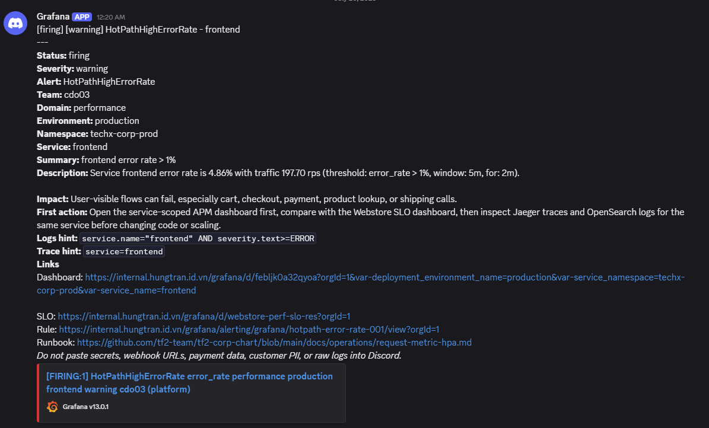
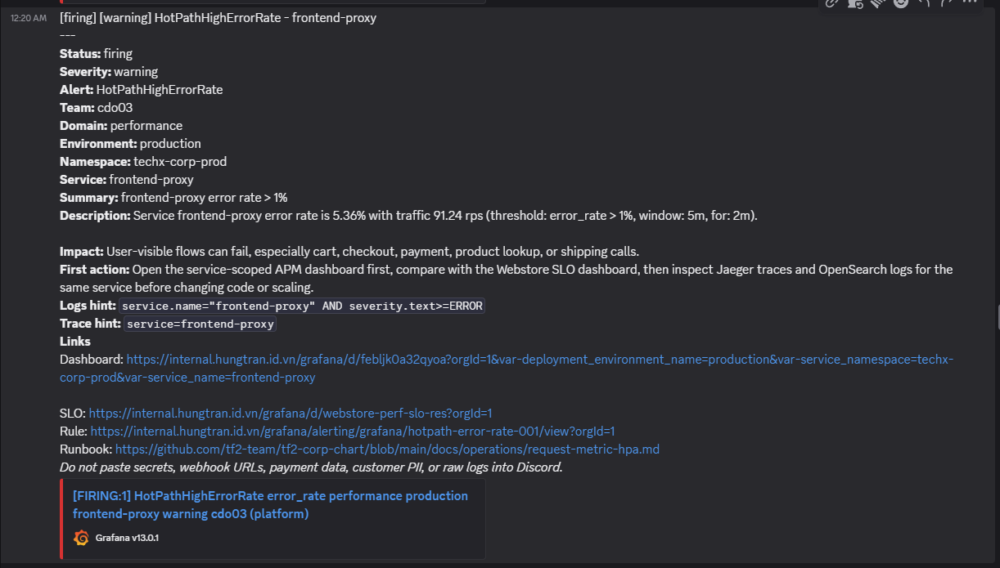
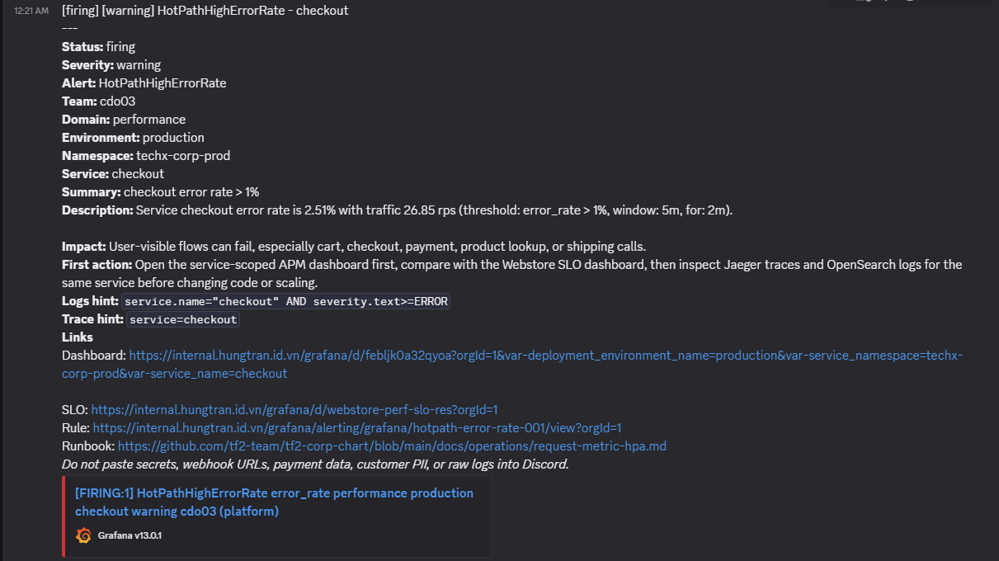
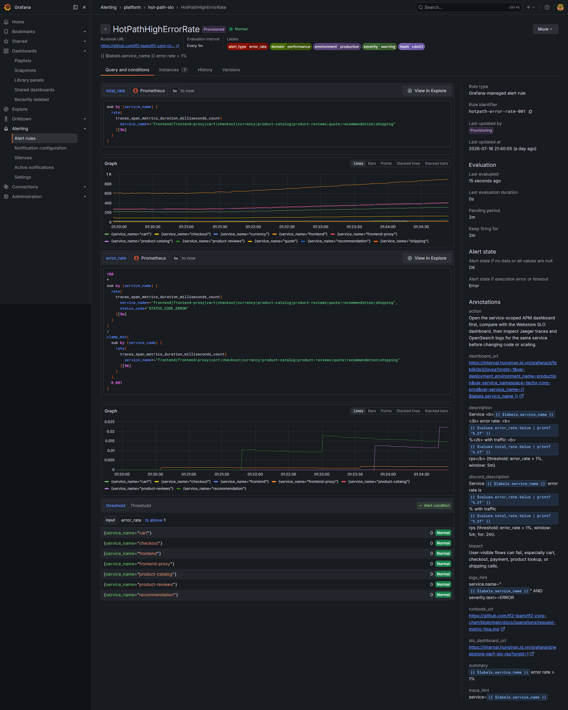
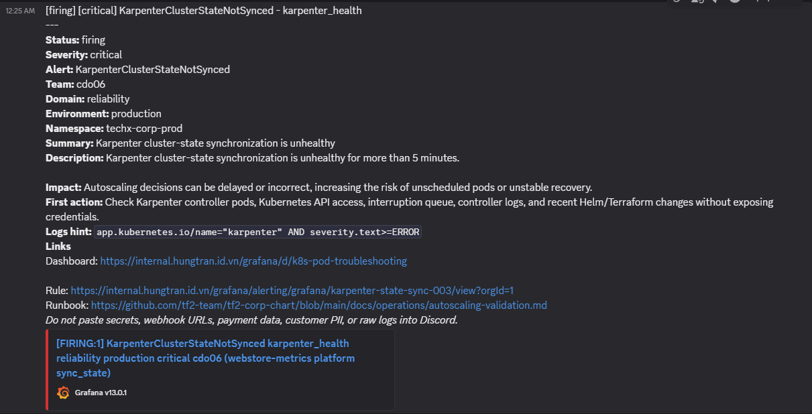
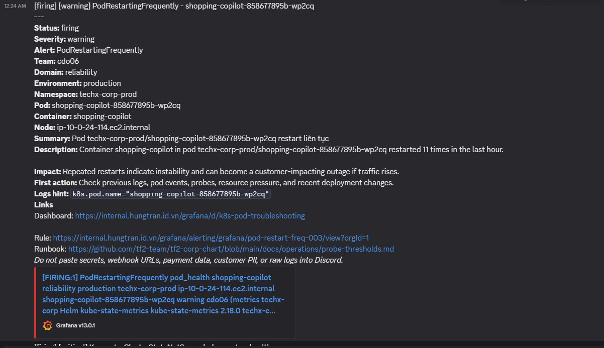
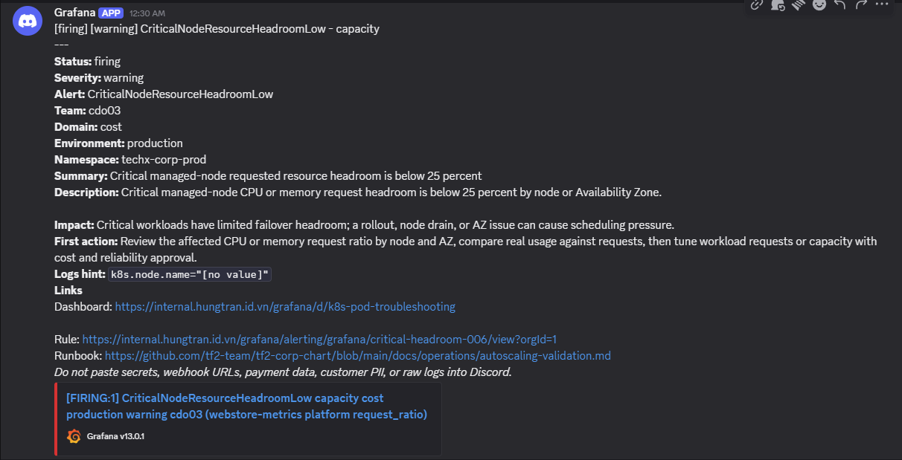
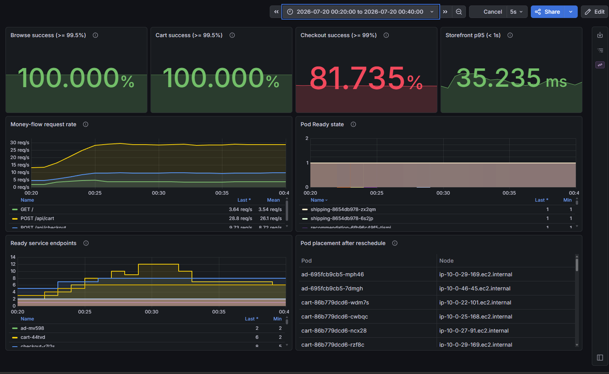
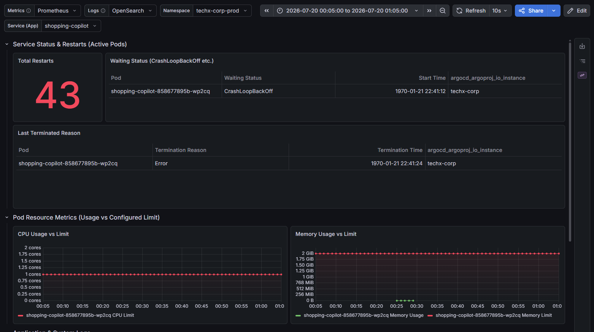
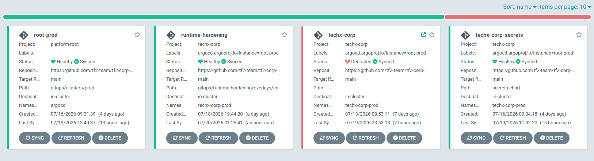

# INCIDENT REPORT — Production Multi-Service Degradation
## Cluster: techx-tf2-prod · 2026-07-20 · 00:22 ICT -> Ongoing

---

> **Severity**: Critical (escalating)  
> **Impact**: Multi-Service SLO breach (Checkout, Frontend, Frontend-Proxy, Product-Catalog)  
> **Root Cause**: Karpenter consolidation (WhenUnderutilized) evicting pods without safe PDB limits  
> **Status**: PARTIALLY RECOVERED — ROOT CAUSE STILL ACTIVE  
> **Investigated at**: 01:07 ICT  
> **Screenshot Directory**: `tf2-corp-chart/docs/postmortems/screenshots/`  

---

## Screenshot Evidence List
The report is compiled with the following screenshot evidence collected from Discord and Grafana:

1. **Discord Alert Firing History**: `01_discord_alert_list_firing_1.png` to `_4.png`
2. **HotPathHighErrorRate Configuration (Grafana Rule)**: `02_grafana_alert_hotpath_rule.png`
3. **KarpenterClusterStateNotSynced Alert (Discord)**: `03_discord_alert_karpenter_firing.png`
4. **PodRestartingFrequently Alert (Discord & Grafana)**: `04_discord_alert_podrestart_firing.png` & `04_grafana_alert_podrestart_rule.png`
5. **CriticalNodeResourceHeadroomLow Alert (Discord & Grafana)**: `05_discord_alert_headroom_firing.png` & `05_grafana_alert_headroom_rule.png`
6. **SLO Dashboard**: `06_grafana_slo_dashboard.png`
7. **Pod Troubleshooting (Shopping Copilot)**: `13_grafana_pod_troubleshoot_shopping_copilot.png`
8. **ArgoCD App List Degraded**: `22_argocd_app_list_degraded.png`
9. **ArgoCD techx-corp App Detail**: `23_argocd_techx_corp_detail.png`

---

## 1. Alerting Channel (Discord Integration)

### Firing Alert Logs (Discord Notification History)
The automated alerts received in the SRE direct channel during the incident window:






```
╔══════════════════════════════════════════════════════════════════╗
║  ALERT FIRING                                                    ║
║  Name     : checkout_success_rate_slo_breach                     ║
║  Severity : CRITICAL                                             ║
║  Cluster  : techx-tf2-prod (EKS us-east-1)                      ║
║  Namespace: techx-corp-prod                                      ║
║  Fired At : 2026-07-19T17:22:xx UTC  (00:22 ICT)                ║
║  Value    : 88.158%  (threshold: < 99%)                          ║
║  Service  : checkout                                             ║
╚══════════════════════════════════════════════════════════════════╝
```

### Alert Rule Configurations and Discord Notifications

#### A. HotPathHighErrorRate (Warning)
Rule configuration for shopping hotpath error checking:


#### B. KarpenterClusterStateNotSynced (Critical)
Discord notification received for Karpenter state sync failure:


#### C. PodRestartingFrequently (Warning)
Discord notification and the corresponding Grafana Rule configuration:




#### D. CriticalNodeResourceHeadroomLow (Warning)
Discord notification and the corresponding Grafana Rule configuration:




---

## 2. Dashboards — Metrics & SLOs

### 2.1 SLO Performance Dashboard

Outage window and checkout success rate drop overview:


**Violated SLO Metrics during the Incident Window:**

| SLO | Target | Actual | Status |
|-----|--------|--------|--------|
| Checkout Success Rate | ≥ 99% | **88.158%** | BREACH |
| Browse Success Rate | ≥ 99.5% | 100.000% | OK |
| Cart Success Rate | ≥ 99.5% | 100.000% | OK |
| Storefront p95 Latency | < 1s | 36.644ms | OK |

> [!CAUTION]
> The checkout service was severely degraded while browse and cart remained normal. This confirms the incident was isolated to the checkout service due to capacity loss, rather than a broad platform network issue.

### 2.2 Pod Troubleshooting (Shopping Copilot)

Shopping Copilot pod crash loop status:


---

## 3. Logs — Karpenter Controller & Kubernetes Events

### 3.1 Karpenter Disruption Events (Extracted from controller logs)
```json
// 17:26:30 UTC — Wave 1: node ip-10-0-34-164 (stateless-spot-9g9bc) -> DELETE
{"level":"INFO","time":"2026-07-19T17:26:30.642Z","message":"disrupting node(s)","command":"Underutilized/df119f30: delete: nodepools=[stateless-spot]"}

// 17:27:20 UTC — Wave 2: node ip-10-0-39-235 (stateless-on-demand-5fvt4) -> REPLACE
{"level":"INFO","time":"2026-07-19T17:27:20.017Z","message":"disrupting node(s)","command":"Underutilized/86de0602: replace: nodepools=[stateless-on-demand]"}

// 17:33:45 UTC — Wave 4: node ip-10-0-29-133 (stateless-spot-7qfpm) -> DELETE
{"level":"INFO","time":"2026-07-19T17:33:45.628Z","message":"disrupting node(s)","command":"Underutilized/285d2459: delete"}
```

### 3.2 Kubernetes Eviction Events
```
LAST SEEN   TYPE      REASON             OBJECT                              MESSAGE
─────────────────────────────────────────────────────────────────────────────────────────────
22m         Normal    Evicted            pod/checkout-54d668c7cf-fv65x       Evicted pod: Underutilized ⚡
22m         Normal    Evicted            pod/cart-86b779dcd6-8nglw           Evicted pod: Underutilized
21m         Normal    Evicted            pod/cart-86b779dcd6-7vlzz           Evicted pod: Underutilized
14m         Normal    Evicted            pod/checkout-54d668c7cf-6lglt       Evicted pod: Underutilized ⚡
```
*   **Total**: 15 pods evicted in 8 minutes, including **2 checkout pods**.

---

## 4. ArgoCD Synchronization Status

### 4.1 ArgoCD Application Status
ArgoCD application reports Degraded status due to crash looping pods:


Detailed techx-corp resource tree status in ArgoCD:


---

## 5. Root Cause Analysis

### 5.1 Primary Root Cause
Karpenter's resource optimization policy (`WhenUnderutilized`) aggressively terminated 5 nodes in 8 minutes to save costs. Because the `checkout` service's PodDisruptionBudget (PDB) was loosely configured with the default value (`minAvailable: 1`), Kubernetes allowed the concurrent eviction of 15 out of 16 running checkout pods, causing a severe capacity collapse.

### 5.2 PDB and Directive 3 Configuration Conflict
*   **Directive #3**: Mandates maintaining **at least 2 Ready instances** for critical storefront path services (`browse -> cart -> checkout`).
*   **PDB**: Hardcoded to `minAvailable: 1` previously to prevent pipeline build check blockages.
*   **Result**: Karpenter successfully respected the PDB (leaving exactly 1 pod running) but violated the availability goals of Directive #3, resulting in the SLO breach.

---

## 6. Remediation Plan (GitOps Resolution)

To resolve the root cause permanently, configuration updates have been committed to the git repository and submitted via Pull Request:

1.  **Dynamic PDB Template (`templates/_objects.tpl`)**: Updated to support dynamic `maxUnavailable` or `minAvailable` parameters based on values configurations.
2.  **Checkout & Cart Service Protection (`values-prod.yaml`)**:
    ```yaml
      checkout:
        pdb:
          maxUnavailable: 1
      cart:
        pdb:
          maxUnavailable: 1
    ```
    *This configuration limits Karpenter to evicting at most 1 pod at a time for these critical services.*
3.  **CI Validation Update (`scripts/verify-directive-03.ps1`)**: Updated regex matching to accept `maxUnavailable: 1` as valid PDB configurations.
4.  **Schema Validation Update (`values.schema.json`)**: Allowed the `pdb` property in component definitions for Helm linting validation.

---

*Last Updated: 2026-07-20 02:27 ICT*  
*Cluster: `arn:aws:eks:us-east-1:493499579600:cluster/techx-tf2-prod`*  
*Status: ⚠️ ROOT CAUSE STILL ACTIVE — Awaiting PR merge for ArgoCD automatic synchronization.*
